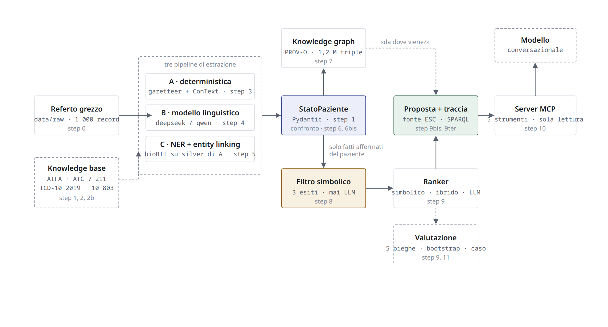
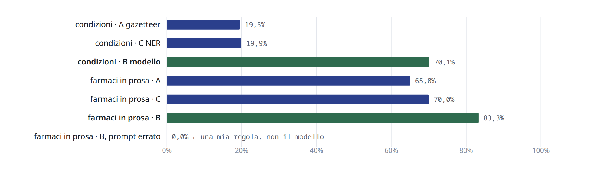
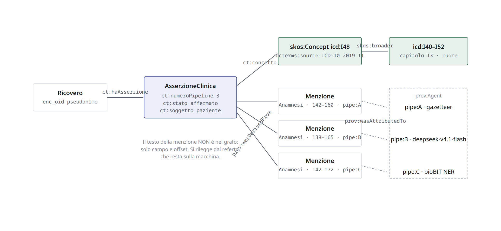
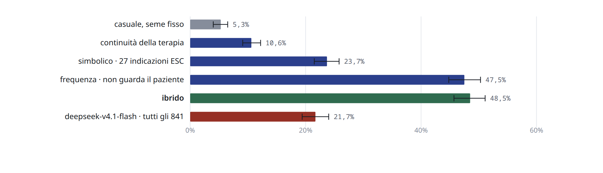
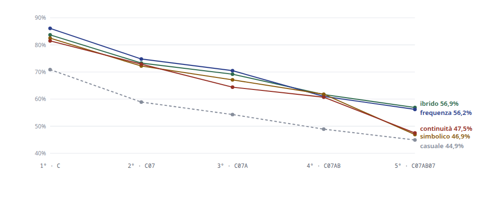
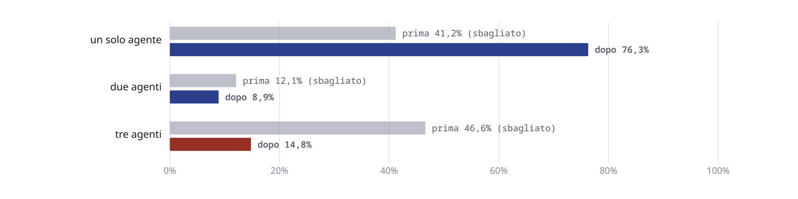

# Sistema di supporto alla decisione terapeutica in cardiologia

**Relazione di progetto — Natural Language Processing for Digital Health, 2026**

Un sistema che legge referti di ricovero cardiologico in italiano, ne estrae
lo stato clinico con tre pipeline diverse, lo codifica in ICD-10 e ATC, lo
mette in un knowledge graph con la provenienza di ogni fatto, e propone la
terapia di dimissione passando da un filtro di sicurezza simbolico e da un
ranker misurato contro le decisioni vere dei cardiologi. Il tutto è esposto
come server MCP a un modello conversazionale, con una traccia che dice *per
quali parole del referto* una proposta esiste.

Il brief del progetto è in [`docs/brief.md`](docs/brief.md); un documento per
step in [`docs/`](docs/), con [`docs/00_architettura.md`](docs/00_architettura.md)
come indice; [`docs/guida_al_codice.md`](docs/guida_al_codice.md) spiega il
codice modulo per modulo.

---

## Indice

1. [Il progetto in una pagina](#1-il-progetto-in-una-pagina)
2. [Il dataset e i vincoli](#2-il-dataset-e-i-vincoli)
3. [Architettura](#3-architettura)
4. [La parte NLP: dal testo allo stato del paziente](#4-la-parte-nlp-dal-testo-allo-stato-del-paziente)
5. [Il knowledge graph](#5-il-knowledge-graph)
6. [Il motore di raccomandazione](#6-il-motore-di-raccomandazione)
7. [Il server MCP](#7-il-server-mcp)
8. [Valutazione](#8-valutazione)
9. [Scelte implementative e alternative scartate](#9-scelte-implementative-e-alternative-scartate)
10. [Limiti e lavoro futuro](#10-limiti-e-lavoro-futuro)
11. [Esecuzione](#11-esecuzione)

---

## 1. Il progetto in una pagina

**Compito.** Dato un referto — anamnesi in prosa, terapia all'ingresso,
terapia alla dimissione — proporre le classi di farmaci da **aggiungere**
alla dimissione, con la motivazione come cammino nel grafo di conoscenza. La
verità di riferimento era già nei dati: la terapia che il cardiologo ha
davvero prescritto, su **841** ricoveri.

**Che cosa ha funzionato**

- Ogni codice viene da una knowledge base citata: 94% dei farmaci risolti ad
  ATC via AIFA con metodo e fonte per voce; 10 803 codici ICD-10 estratti dal
  PDF ufficiale italiano.
- Sul testo libero il modello linguistico vince: richiamo **70,1%** sulle
  condizioni contro 19,5% del gazetteer e 19,9% del NER, misurato su 25
  referti annotati a mano. Sui campi strutturati il parser deterministico fa
  100% gratis.
- Il knowledge graph con la provenienza ha smascherato un «consenso a tre
  pipeline» del 46,6% che era una lettura contata tre volte: il valore vero è
  14,8%.
- Il filtro simbolico non blocca a vuoto: su 5 863 prescrizioni reali, 91,3%
  ammesse e 4 vietate; e ha prodotto il principio più riusato del progetto —
  *una regola che dipende da un fatto che il sistema non estrae segnala, non
  vieta*.
- La traccia risponde «da dove viene?» in SPARQL; il server MCP espone sei
  strumenti di sola lettura, e un modello locale sceglie quello giusto 9 volte
  su 10.

**Che cosa non ha funzionato**

- Il ranker «migliore» non è distinguibile da un contatore di frequenza che
  non guarda il paziente: F1 alla pari a ognuno dei cinque livelli ATC
  (alla sostanza **56,9 contro 56,2**, differenza [+0,1, +1,2]; al 1°
  livello [−2,9, −2,0]), dentro il rumore. Centra più spesso *almeno una*
  aggiunta (top-5 alla sostanza 74,5% contro 66,8%), ma sull'insieme della
  terapia le proposte sbagliate pesano uguale.
- Il ranker con modello linguistico perde di 7–9 punti di F1 contro quel
  contatore (51,0 contro 59,3 al 4° livello, su tutti gli 841 ricoveri):
  propone la cardiologia giusta e manca il **40,4%** delle prescrizioni che
  cardiologia non è.
- Il 1° livello ATC è generoso con chiunque: tirare a sorte fa F1 70,9 al
  gruppo anatomico, perché in cardiologia quasi tutto sta in `C`.
- Il NER addestrato su etichette silver non trova ciò che il gazetteer non
  trova, e ciò che trova in più non sa codificarlo; il NER clinico italiano
  pre-addestrato trovato su Hugging Face vede 2,5 volte più condizioni con
  precisione 31%.
- Le garanzie finiscono al confine dello strumento: un modello davanti al
  server MCP ha riscritto «iperteso» in «Ipotensione» con una catena di
  provenienza formalmente corretta. Ora è contato; non è impedibile.

**Rumore di fondo del progetto: due punti percentuali.** È la variazione fra
corse dello stesso modello sugli stessi record e fra ricampionamenti dello
stesso campione. Una differenza più piccola non è un risultato.

---

## 2. Il dataset e i vincoli

`data/raw/anamnesiterapie.txt`: un array JSON di **1 000** ricoveri
cardiologici, pseudonimizzati, esportati dal sistema ospedaliero. Tre referti
per ricovero:

| campo | presente in | lunghezza min / mediana / max | natura |
| --- | --- | --- | --- |
| Anamnesi | 1 000 | 222 / 1 665 / 17 590 caratteri | prosa libera |
| Terapia medica all'ingresso | 1 000 | 4 / 275 / 1 899 | lista con `;`, nomi commerciali |
| Terapia alla Dimissione | 857 | 15 / 649 / 2 281 | voci fra virgolette, principio attivo |

Nella stessa cartella c'erano due varianti «più ricche», con i campi già
separati e un questionario di condizioni: erano il grezzo passato per un
modello linguistico, e sono state scartate. Costruire tre pipeline di
estrazione sopra un'estrazione fatta da un modello avrebbe misurato quella.

**I vincoli, e il perché.**

| vincolo | perché |
| --- | --- |
| solo dati grezzi | i derivati misurerebbero l'estrazione di qualcun altro |
| ogni mappatura da una knowledge base citabile (AIFA, ICD-10 2019, ESC) | un modello produce codici plausibili e non verificabili; una voce non coperta si marca, non si inventa |
| si conserva tutto | le voci non risolte restano marcate: servono a vedere che cosa è stato mancato |
| il dataset non si versiona | è dell'ospedale; `data/` è in `.gitignore` |
| la sicurezza è sempre simbolica | il filtro non impara dal dataset e non chiede a un modello: ogni regola porta la fonte e si contesta riga per riga |
| tre esiti, non due | un falso blocco nega una terapia, un falso permesso lascia passare una controindicazione |
| prima il modello locale, si paga solo con numeri misurati | spesa totale del progetto in inferenza: **4,79 $** |

---

## 3. Architettura



Il referto entra in tre pipeline indipendenti che producono lo stesso oggetto
`StatoPaziente`; il grafo di provenienza le tiene insieme; filtro e ranker
lavorano sui soli fatti affermati del paziente, leggendo le regole dal grafo
di conoscenza; la traccia interroga entrambi i grafi; il server MCP espone
tutto a un modello conversazionale. **Tre pipeline e non una** perché lo scopo
è confrontare metodi di estrazione; **il filtro è simbolico per vincolo**
perché una regola di sicurezza deve poter essere contestata da un clinico.

| strato | moduli (`src/`) | step |
| --- | --- | --- |
| dati e knowledge base | `data_loading`, `explore_dataset`, `fetch_external_kb`, `build_vocabularies`, `extract_icd10`, `normalize_drugs` | 0, 1, 2, 2b |
| contratto dati | `schema` (`StatoPaziente`, Pydantic) | 1 |
| estrazione | `gazetteer` + `context_it` + `extract_a` · `llm_backend` + `extract_b` · `silver_labels` + `ner_train` + `ner_infer` + `entity_linking` + `extract_c` | 3, 4, 5 |
| codifica condivisa | `risolutori` | 3–5 |
| confronto e riferimento | `confronto`, `riferimento` | 6, 6bis |
| grafi | `kb_build` + `conoscenza` (conoscenza clinica, `kb/conoscenza.ttl`) · `grafo` + `interroga` + `traccia` (provenienza) | 7, 9ter |
| decisione | `filtro`, `ranker`, `valuta_ranker`, `demo` | 8, 9, 9bis |
| esposizione | `mcp_server`, `mcp_client_locale`, `valuta_mcp` | 10 |
| valutazione | `valuta_gerarchica` | 11 |

Ogni modulo ha il suo file di test; 471 test, nessuno usa la rete.

---

## 4. La parte NLP: dal testo allo stato del paziente

### 4.1 Il contratto dati: `StatoPaziente`

Le tre pipeline producono lo stesso oggetto (Pydantic v2), che è l'unico
input del motore:

```python
class StatoPaziente(BaseModel):
    enc_oid: int; pipeline: Pipeline; versione_schema: str = "1.1.0"
    condizioni: list[CondizioneEstratta]   # testo_grezzo, concetto, codice ICD-10, stato, soggetto, provenienza
    farmaci:    list[FarmacoEstratto]      # nome_grezzo, codice_atc, momento (ingresso/dimissione/narrativo), provenienza
    allergie:   list[AllergiaEstratta]     # allergene, categoria, codice_atc, provenienza
    stato_sezione_allergie: StatoConoscenza   # ignoto / negato / affermato
```

Tre scelte reggono tutto il resto. **Tre stati di conoscenza** (affermato,
negato, incerto) e non un booleano: «non riferisce angina» è la stessa
parola con verità opposta. **Il soggetto separato dallo stato** (paziente,
familiare): «padre deceduto per infarto» è vero e non è del paziente —
l'asse è stato aggiunto nella versione 1.1.0 dopo che il confronto dello
step 6 ha trovato un flutter atriale del *feto* attribuito alla paziente.
**Provenienza obbligatoria** su ogni entità: pipeline, campo, offset di
carattere, regola che l'ha prodotta. Lo stato della sezione allergie è
separato dalla lista: sezione assente, «non note» e lista vuota sono tre
cose diverse per un filtro di sicurezza.

### 4.2 Normalizzazione: vocabolari chiusi e knowledge base

**Ogni campo il suo metodo.** I due campi di terapia sono liste con
delimitatori: si leggono con un parser (100% sull'ingresso, misurato) e sono
una verità gratuita. La prosa richiede riconoscimento.

**Il vocabolario chiuso** (brief, sez. 3.1) viene dal dataset — 406 principi
attivi, 923 nomi commerciali, 249 condizioni candidate — e definisce lo
*scope*, non le relazioni. La risoluzione ad ATC usa il registro AIFA con una
**cascata di sei strategie**, dal più stretto al più largo, ognuna
registrata nella voce:

| strategia | esempio | voci |
| --- | --- | --- |
| principio esatto | `Bisoprololo` → C07AB07 | 296 |
| associazione (`/` nel dataset, «E» in AIFA) | `Rosuvastatina/ezetimibe` → C10BA06 | 12 |
| commerciale esatto | `Congescor` → C07AB07 | 629 |
| commerciale abbreviato (sigla del produttore dai titolari AIC) | `pantoprazolo sand` → A02BC02 | 188 |
| suffisso salino / forma salina | `Warfarin sodico` → B01AA03; `Enoxaparina` → B01AB05 | 21 |

94% delle occorrenze risolte; le ambiguità (`lyrica`: due ATC) restano
marcate; i NIL sono voci fuori registro (`ferrograd`, 64 occorrenze).

**La terminologia ICD-10** viene dal PDF dell'Elenco Sistematico 2019
(890 pagine, `pdftotext -layout`): 10 803 codici, 14 898 termini con i
parentetici espansi. Il confronto di stringhe con le condizioni del dataset
copre il 18% e produce collegamenti sbagliati («non versamento pericardico»
→ versamento pericardico): la codifica non può essere un confronto di
stringhe, e la polarità va decisa dal contesto.

### 4.3 Pipeline A — deterministica: gazetteer + ConText

`PhraseMatcher` di spaCy sulle forme dei vocabolari (farmaci da
`mappatura_atc.json`, condizioni dai termini ICD filtrati e arricchiti di
varianti senza qualificatori). Poi **ConText riscritto per l'italiano**
(l'algoritmo è di Harkema et al. 2009, doi:10.1016/j.jbi.2009.05.002):

- **marcatori** con attributo, direzione e ampiezza, ricavati contando nel
  corpus: `non` 2 665 occorrenze, `nega` 522, `assenza di` 370, `senza` 319,
  `negativo per` 102; `sospetto` 134; `pregressa` 253;
- **terminatori** che chiudono l'ambito (`ma`, `riferisce`, punteggiatura);
  l'interazione fra `non` e il terminatore `riferisce` lasciava «non
  riferisce angina» affermato: `non riferisce` è ora un marcatore composto,
  giustificato da 48 occorrenze nel corpus;
- **asse del soggetto**: un ambito di familiarità aperto da «familiarità
  per», «madre», «padre deceduto per»… con una massima ampiezza, che
  assegna `soggetto = familiare`.

Esempio (paziente sintetico): «*Non riferisce angina né cardiopatia
ischemica. Padre deceduto a 60 anni per infarto miocardico. Segue cura per
ipertensione arteriosa dal 2019.*» → `I51.9 cardiopatia: negato / paziente`,
`I10 ipertensione: affermato / paziente`; l'infarto del padre non diventa una
condizione del paziente.

Su 1 000 record: 5 237 condizioni (299 negate), 83% con codice; 14 235
farmaci, 93,5% con ATC. Precisione alta, richiamo basso: il gazetteer vede
solo ciò che è nel vocabolario.

### 4.4 Pipeline B — modello linguistico

**Che cosa si chiede al modello, e che cosa no.** Lo schema che riceve
(`EstrazioneLLM`) non ha campi per i codici: un modello produrrebbe ATC e
ICD plausibili ma non tracciabili a una fonte; i codici li assegnano i
risolutori condivisi, dopo. Si chiede la **citazione letterale** di ogni
menzione, cercata nel testo: se non c'è, la menzione è *non ancorata* e
conta — è il rilevatore di allucinazioni, 0,3% sulla corsa finale. L'unico
campo interpretativo è `concetto`, l'acronimo sciolto, usato come chiave di
ricerca nell'indice ICD e mai creduto sulla parola (`BBS` → «blocco di
branca sinistra» → I44.7, dove il gazetteer non ha appigli). Il modello
legge **solo l'anamnesi**: i campi di terapia li legge il parser.

**Backend intercambiabili e cache.** `BackendLLM.genera(Richiesta) ->
Risposta` con tre implementazioni (Ollama in locale, OpenRouter a consumo,
fittizio per i test) e una cache su disco per impronta della richiesta
(`sha256(modello + istruzioni + testo + schema + temperatura)`), in cui ogni
risposta porta i propri token e costo. Una metrica nuova sulle stesse
risposte è gratis; il costo si somma dai file.

**La scelta del modello, misurata.** Gemini gratuito: 20 richieste al giorno.
`qwen3:4b` locale su GPU Radeon: 159–235 s per record, 65 ore per il corpus.
`deepseek/deepseek-v4.1-flash` via OpenRouter: 1 000 record in 39 minuti,
2,42 $; con il prompt finale 1,65 $. La decisione di pagare è stata presa con
i token misurati sulla corsa locale in cache, non con una stima.

**I difetti erano del prompt.** Un esempio positivo nel prompt (`mdc`) è
stato ricopiato come allergia 105 volte; una regola che definiva i farmaci
come «contenuto delle sezioni di terapia» faceva omettere tutti i farmaci
narrati (0/60 sul riferimento → 83,3% dopo la correzione); un array senza
`maxItems` non termina sotto decodifica vincolata (310 voci da 91
candidati). Cinque difetti su sette erano nelle istruzioni, non nel modello.

### 4.5 Pipeline C — NER + entity linking

Un NER è un classificatore di token che deve aver visto esempi etichettati.
Il brief esclude l'annotazione manuale e prescrive la supervisione debole:
etichette **silver** dall'uscita della pipeline A (7 649 menzioni), divisione
per ricovero 700/150/150, fine-tuning di **`IVN-RIN/bioBIT`** (Buonocore et
al. 2023, doi:10.1016/j.jbi.2023.104431 — un BERT italiano continuato su
testo biomedico) su CPU, tre epoche in un'ora, allineamento caratteri →
sottotoken con la mappa di offset, valutazione per entità: F1 0,869 sulla
prova. Il NER trova 228 menzioni che il gazetteer non ha (`dronedarone`,
`pericardite`) ed evita 95 suoi errori: ha imparato il contesto, non il
vocabolario. Ma non sa codificarle: −142 condizioni con codice, +231 ambigue.
La similarità ortografica come collegatore sbaglia 3 volte su 6 con il
punteggio più alto sull'errore peggiore (`insufficienza mitralica moderata` →
`…congenita`): declassata a proposta `AMBIGUO`, mai al filtro. Gli acronimi
(`BPCO`, `FA`) non sono risolvibili da nessuna fonte citabile.

**Il pre-addestrato che il brief chiede di valutare prima.** Su Hugging Face
esiste un solo NER clinico italiano, `HUMADEX/italian_medical_ner`
(Sallauka et al. 2025, doi:10.3390/app15105585). Sui 25 referti del
riferimento: condizioni richiamo 51,7% ma precisione 31,0%; farmaci
precisione 3,6%; e nessun codice. Sposta il problema dal riconoscimento al
linking senza risolverlo.

### 4.6 Confronto e riferimento

Sulla prosa le tre pipeline vedono cose diverse: 12 511 punti visti dalla
sola B, 325 dalla sola C, 145 dalla sola A. Aggiudicando a mano un campione
delle esclusive: B precisione 91,7% ± 3,6, A 73,3% ± 8,1, C 66,7% ± 8,6 —
ma **gli errori di A arrivano già codificati 7 volte su 8**, quelli di C
mai. Un riferimento annotato a mano su 25 referti (559 condizioni, 60
farmaci narrati; linee guida fissate prima; un solo annotatore, limite
dichiarato) misura il richiamo:



| condizioni | precisione | richiamo | F1 |
| --- | --- | --- | --- |
| A · gazetteer | 80,1% | 19,5% | 31,4% |
| **B · modello linguistico** | **96,1%** | **70,1%** | **81,1%** |
| C · NER | 81,6% | 19,9% | 31,9% |

Nessuna pipeline vince: sono tre profili di errore. Il progetto le usa
insieme, con la provenienza.

---

## 5. Il knowledge graph

Due grafi RDF (`rdflib`), con lo stesso spazio di nomi per i concetti.

**La conoscenza clinica** — `kb/conoscenza.ttl`, versionato, 805 triple —
è il grafo del brief, sez. 3.3: nodi `Drug` (classi ATC, con etichetta AIFA),
`Condition` (ICD-10), `Guideline` (documento citato); relazioni reificate
`Indicazione` (27: farmaco → condizione, classe di raccomandazione ESC,
motivo, fonte, eventuale terapia che la innesca, fatto non estratto) e
`Controindicazione` (12: esito, fonte RCP/ESC, fatti che la revocano). Lo
script `kb_build.py` le dichiara e scrive il Turtle; `conoscenza.py` lo
legge; **ranker e filtro prendono le regole da lì**, e un test verifica che
il Turtle nel repository sia identico a quello rigenerato.


Perché la curatela è manuale e non importata: la sonda su Wikidata (372 dei
439 principi attivi trovati, 273 con «condizione trattata», 158 con
interazioni) mostra che la copertura c'è, ma senza classe di
raccomandazione, senza fonte citabile e senza codice ICD-10 per la
condizione. Le interazioni farmaco-farmaco non ci sono, e l'assenza è
dichiarata.

**La provenienza** — `data/processed/grafo.ttl`, 1,2 M triple, non
versionato — modella **la menzione come nodo**: l'asserzione clinica è
derivata (PROV-O) dalle menzioni sovrapposte che la sostengono, ciascuna
attribuita al suo agente.



```text
ricoveri 1 000 · menzioni 69 533 · asserzioni 32 716
  sostenute da 1 agente 76,3% · 2 agenti 8,9% · 3 agenti 14,8%
```

Il 46,6% di consenso a tre riportato in prima battuta era il parser dei
campi strutturati contato come tre agenti: il grafo esiste esattamente per
rendere interrogabile questo tipo di domanda (`COUNT(DISTINCT ?agente)`).
Il grafo **non decide**: non fonde le contraddizioni, non scarta le menzioni
irrisolte (40,8% delle condizioni senza codice). La decisione è dello step 8.

---

## 6. Il motore di raccomandazione

### 6.1 Fase 1 — il filtro di sicurezza, simbolico

Quattro famiglie di regole: allergia alla sostanza (vietato), allergia al
sottogruppo ATC (da verificare: la reattività crociata non è un divieto),
duplicazione terapeutica, controindicazione per condizione (12 regole con
fonte RCP 4.3 o ESC). Solo le condizioni **affermate e del paziente**
controindicano. Il verdetto è il massimo dei motivi.

Provato contro le 5 863 prescrizioni reali: 91,3% ammesse, 8,6% da
verificare, **4 vietate**. La prima versione ne vietava 28: ventiquattro
erano betabloccanti in pazienti con blocco AV *e pacemaker*, che nessuna
pipeline estrae. Da qui il **principio del fatto mancante**: una regola la
cui premessa richiede un fatto che il sistema non sa stabilire segnala, non
vieta. È ricomparso cinque volte nel progetto.

Il richiamo del filtro non ha una verità; venti casi avversari attraverso
l'estrazione ne coglie 14. I sei mancati sono tutti termini che il
vocabolario chiuso non conosce («ASA», «aspirina», «asma bronchiale»): il
richiamo del filtro è limitato dall'estrazione, non dalle regole.

### 6.2 Fase 2 — i ranker

L'unità è la **classe ATC** a cinque caratteri (`C07AB`, non il
bisoprololo). Il compito è ordinare le classi da **aggiungere**: 2 075
decisioni su 841 ricoveri, perché copiare la terapia d'ingresso copre già
il 63,6% della dimissione.

| ranker | come decide |
| --- | --- |
| continuità | ripropone la terapia in atto (linea di base del compito 1) |
| frequenza | le classi più aggiunte nel reparto, **senza guardare il paziente** |
| simbolico | il peso della migliore indicazione ESC che scatta (I 1,0 · IIa 0,6 · IIb 0,3): il massimo, non la somma |
| ibrido | `log P(classe) + max PMI(condizione, classe) + peso × simbolico` — a evidenza zero ricade sulla frequenza, per costruzione |
| con modello linguistico | il modello ordina i candidati già filtrati; i codici fuori elenco vengono scartati e contati |

**Il tetto, noto prima di misurare.** Il 40,4% delle prescrizioni non è
cardiologia (gastroprotettori 525, antidiabetici, potassio…): nessuna linea
guida cardiologica le regola, e un ranker a linee guida ha un tetto per
costruzione.

---

## 7. Il server MCP

`MCPServer` dell'SDK `mcp` 2.x, sei strumenti con `read_only_hint=True`,
nessun argomento che indichi un ricovero (il corpus non passa di qui):

| strumento | risponde a |
| --- | --- |
| `cardio_proponi_terapia` | che cosa aggiungere — dal testo |
| `cardio_proponi_da_stato` | idem — da uno `StatoPaziente` (la firma del brief, sez. 3.5, schema Pydantic generato) |
| `cardio_sostegno_del_concetto` | da dove viene questo fatto (SPARQL) |
| `cardio_verifica_sicurezza` | il verdetto del filtro; rifiuta ciò che non è un codice |
| `cardio_cerca_codice` | ATC e ICD-10 per nome o codice |
| `cardio_statistiche_corpus` | solo aggregati |

Ogni proposta dichiara il **fondamento** (indicazione citata, oppure
co-occorrenza misurata con avvertimento), i fatti mancanti e il ranker usato.
Due client: Claude Code e un host locale con `qwen3.5:4b` via ollama. Dieci
domande scritte prima, due corse: strumento giusto 9/10, testo intatto 6/6,
risposte 10/10. Tre difetti trovati alla frontiera — proposte a tasso di base
presentate come fondate, l'anamnesi **parafrasata** («iperteso» →
«Ipotensione»), il filtro che diceva «ammesso» a un nome invece di un codice
— tutti corretti o resi visibili; la parafrasi resta contabile, non
impedibile.

---

## 8. Valutazione

**La misura** (metrica primaria del brief, sezione 4). Per ogni ricovero il
sistema produce una *terapia proposta*: la terapia d'ingresso continuata più
le 5 classi nuove che il ranker mette in cima. La si confronta con la
*terapia di dimissione* scritta dal medico, che nessun ranker riceve. I codici
sono risolti alla sostanza (7 caratteri ATC) e troncati a ciascuno dei cinque
livelli; a ogni livello si calcolano precisione (quota delle proposte
prescritte davvero), richiamo (quota delle prescrizioni proposte) e F1, medie
sui ricoveri. La versione top-5 del brief conta i ricoveri in cui almeno una
delle 5 proposte nuove coincide con un'aggiunta reale.

**Il protocollo.** Validazione incrociata a 5 pieghe con pieghe
deterministiche per hash del ricovero e insieme candidato ricostruito per
piega; bootstrap su 1 000 ricampionamenti *dei ricoveri* con differenze
appaiate; un ranker casuale a seme fisso come controllo; rumore di fondo 2
punti (una differenza minore non si racconta). Un esempio svolto a mano,
livello per livello, è nel [documento dello step 11](docs/11_valutazione.md).

**Le prove fatte**, in una tabella; ogni sezione sotto dice che cosa si è
provato, che cosa si misura e il risultato.

| sez. | prova | misura | risultato in una riga |
| --- | --- | --- | --- |
| 8.1 | 5 ranker, 841 ricoveri, 5 pieghe, unità sostanza | P / R / F1 a ogni livello ATC | ibrido e frequenza alla pari a ogni livello; alla sostanza staccano gli altri di 8–11 |
| 8.2 | stessi ranker | top-5: almeno un'aggiunta centrata | ibrido avanti, [+4,7, +10,8] alla sostanza |
| 8.3 | + ranker LLM dalla cache (unità classe) | P / R / F1, 4 livelli | LLM sotto la frequenza di 7–9, alla pari col simbolico |
| 8.4 | ranker casuale a seme fisso | le stesse misure | F1 70,9 al 1°, 44,9 alla sostanza: la distanza dal caso è il guadagno vero |
| 8.5 | stato da A, B e C | F1 per livello | identico a meno di mezzo punto |
| 8.6 | proposte con un'indicazione citabile | quota motivate fra le centrate | ibrido 37,2% contro 33,9%: tre punti |

### 8.1 La prova principale: cinque ranker, cinque livelli

**Provato:** casuale, continuità, frequenza, simbolico, ibrido su tutti gli
841 ricoveri, 5 pieghe, unità = sostanza. **Misurato:** precisione, richiamo
e F1 della terapia proposta contro la dimissione a ogni livello; intervalli
al 95% e differenze appaiate di F1 dal bootstrap.



**Risultato**, P / R / F1 in %:

| ranker | 1° `C` | 2° `C07` | 3° `C07A` | 4° `C07AB` | 5° `C07AB07` |
| --- | --- | --- | --- | --- | --- |
| casuale (controllo) | 63,3 / 86,4 / 70,9 | 51,0 / 74,9 / 58,9 | 46,1 / 71,0 / 54,3 | 40,9 / 65,4 / 48,9 | 37,0 / 61,2 / 44,9 |
| continuità (copia l'ingresso) | 85,8 / 82,6 / 81,5 | 78,7 / 73,6 / 72,9 | 62,7 / 71,0 / 64,4 | 59,5 / 66,6 / 60,7 | 39,4 / 64,1 / 47,5 |
| frequenza (non guarda il paziente) | 84,2 / 92,3 / **86,1** | 71,3 / 84,6 / **74,8** | 65,6 / 82,6 / **70,5** | 53,0 / 78,6 / 61,0 | 47,4 / 75,3 / 56,2 |
| simbolico (linee guida ESC) | **90,0** / 80,8 / 82,5 | **77,0** / 73,2 / 72,2 | **68,6** / 70,3 / 67,1 | **62,3** / 65,7 / **61,8** | 38,8 / 63,5 / 46,9 |
| **ibrido** (indicazioni + co-occorrenza) | 79,8 / **92,8** / 83,7 | 68,3 / **85,2** / 73,3 | 63,2 / **82,9** / 69,2 | 53,7 / **79,2** / 61,7 | 47,9 / **76,2** / **56,9** |

Intervalli al 95% di F1 alla sostanza: ibrido [55,8, 58,1], frequenza [55,1,
57,3], continuità [46,2, 48,7], simbolico [45,5, 48,2], casuale [43,5, 46,4].

| differenza appaiata di F1 | 1° | 3° | 5° | lettura |
| --- | --- | --- | --- | --- |
| **ibrido − frequenza** | [−2,9, −2,0] | [−1,8, −0,8] | [+0,1, +1,2] | dentro il rumore, segno che cambia: **alla pari** |
| ibrido − simbolico | [−0,1, +2,6] | [+1,0, +3,4] | **[+9,2, +10,9]** | alla sostanza esclude lo zero |
| frequenza − continuità | [+3,5, +5,7] | [+5,1, +7,1] | **[+8,0, +9,6]** | esclude lo zero |
| ibrido − frequenza, pieghe stratificate | [−2,7, −1,8] | [−1,8, −0,8] | [+0,0, +1,1] | identico |

**Lettura.** (1) Ibrido e frequenza sono **alla pari in F1 a ogni livello**:
la frequenza ha la precisione più alta dei due, l'ibrido il richiamo, e la
differenza cambia segno. (2) Alla sostanza frequenza e ibrido staccano
simbolico e continuità di 8–11 punti: una linea guida indica la classe, non
la molecola, e dentro la classe il simbolico sceglie a caso. (3) Il
**simbolico ha la precisione più alta** a ogni livello dal 1° al 4° (90,0%
al 1°) e il richiamo più basso: propone poco e giusto. (4) La continuità è
un pavimento alto (F1 81,5 al 1°): i ranker aggiungono qualcosa sopra la
copia solo alla sostanza.

### 8.2 La prova top-5 del brief

**Provato:** stessi ranker e pieghe. **Misurato:** per ogni livello, la
quota dei 714 ricoveri con almeno un'aggiunta in cui almeno una delle 5
proposte nuove coincide con un'aggiunta reale.

**Risultato:** alla sostanza ibrido 74,5%, frequenza 66,8%, simbolico
25,4%, continuità 31,7%, casuale 10,8%; ibrido − frequenza [+1,4, +4,1] al
1°, **[+4,7, +10,8]** al 5°. Qui l'ibrido è avanti e sopra il rumore: centra
più spesso *almeno una* aggiunta (tre ricoveri su quattro contro due su
tre), ma sull'insieme della terapia le sue proposte sbagliate pesano quanto
quelle della frequenza, e l'F1 non lo premia.

### 8.3 La prova col ranker LLM, dalla cache

**Provato:** `deepseek-v4.1-flash` (841 risposte in cache, 0 $ nuovi) ordina
classi a 5 caratteri: prova a unità classe, stessi ricoveri, gli altri
ranker ricalcolati nella stessa unità. **Misurato:** P / R / F1 ai quattro
livelli misurabili (i numeri si confrontano per graduatoria con 8.1, non
cifra per cifra).

**Risultato**, P / R / F1 al 1° e al 4° livello:

| ranker | 1° `C` | 4° `C07AB` | top-5 al 4° |
| --- | --- | --- | --- |
| frequenza | 83,6 / 92,3 / **85,8** | 49,7 / 80,2 / **59,3** | 75,0% |
| ibrido | 77,8 / 92,5 / 82,4 | 49,3 / 79,7 / 58,9 | **78,4%** |
| simbolico | 86,9 / 84,8 / 83,3 | 43,2 / 70,8 / 52,1 | 51,7% |
| **modello linguistico** | **88,8** / 81,1 / 82,1 | 42,2 / 69,5 / 51,0 | 45,8% |

LLM − frequenza **[−5,1, −2,4]** al 1°, **[−9,3, −7,3]** al 4°; LLM −
simbolico [−1,7, −0,5] al 4°. Il modello, vincolato all'insieme candidato e
con lo stesso stato del paziente, sta sotto la frequenza a ogni livello e
alla pari col simbolico: precisione al 1° la più alta della tabella, e come
il simbolico propone poco e cardiologico. 68 codici fuori elenco scartati.

### 8.4 Il controllo casuale

**Provato:** un ranker che permuta i candidati con seme fisso, scritto prima
dei risultati. **Misurato:** le stesse misure (riga «casuale» delle tabelle).



**Risultato:** F1 70,9 al 1° livello e 44,9 alla sostanza. Il 1° livello è
generoso con chiunque: in cardiologia quasi tutto sta in `C`. Il guadagno
vero di un ranker è la distanza dal caso, +12 di F1 alla sostanza per
l'ibrido, non i 57 punti della cifra assoluta.

### 8.5 La prova per pipeline (metrica secondaria del brief)

**Provato:** gli stessi ranker con lo stato estratto da A, B e C.
**Misurato:** F1 per livello. **Risultato:** ibrido alla sostanza 56,9 da A,
56,9 da B, 56,9 da C; il simbolico varia di 1,5 punti al 3° livello (67,1
con B contro 65,6), al pavimento di rumore. L'estrazione conta poco sul
ranking, dominato dalla frequenza.

### 8.6 La prova di spiegabilità

**Provato:** le prime 5 proposte di ogni ranker su ogni ricovero (4 205 per
ranker). **Misurato:** quante hanno almeno un'indicazione ESC che scatta per
quel paziente, fra tutte e fra le centrate. **Risultato**, centri motivati:
frequenza 33,9%, ibrido 37,2%, simbolico 74,1%; `deepseek` (unità classe)
65,8%. Tre punti di vantaggio dell'ibrido, non una categoria: due terzi dei
suoi centri sono «in questo reparto si fa», e il sistema lo dice per ogni
proposta.

### 8.7 I limiti della misura

k è fisso a 5: nel 15% dei ricoveri il medico non aggiunge nulla e il
sistema propone comunque 5 classi, con precisione 17% garantita; un sistema
che sapesse *quando non proporre* guadagnerebbe su tutta la tabella. Il
riferimento è la decisione di un medico, non l'insieme delle terapie
accettabili: la precisione è accordo col medico, non correttezza. Il 40,4%
delle prescrizioni non è cardiologico ed è il tetto del richiamo. E le unità
non si confrontano fra tabelle: a unità sostanza due proposte della stessa
classe collassano in una al 4° livello, quindi la riga del modello
linguistico (unità classe) si confronta per graduatoria, non cifra per cifra.

### 8.8 La provenienza



---

## 9. Scelte implementative e alternative scartate

| scelta | perché | alternativa scartata |
| --- | --- | --- |
| `rdflib` e un file Turtle, non un database a grafo | nessun server da installare per la discussione; SPARQL standard; 1,2 M triple stanno in memoria (41 MB); il grafo di conoscenza è un file versionabile e leggibile | Neo4j / GraphDB: un servizio da amministrare per un progetto individuale |
| filtro e ranker non passano dal grafo | una SPARQL costa 12,43 ms, una lettura da dizionario 0,073 µs; sul ciclo di valutazione (841 × migliaia di candidati) sono ore contro secondi. La traccia sì, perché serve *dopo* | tutto via SPARQL |
| estrazione deterministica come predefinita nella demo e nel server | zero rete, zero chiavi, zero denaro, riproducibile; il modello è opzionale (`--motore`) | il modello sempre attivo: un server che chiama un modello per rispondere a un modello paga due volte |
| prior empirico nell'ibrido (co-occorrenza) | il 40,4% delle prescrizioni non è in nessuna linea guida; senza il prior il ranker ha un tetto per costruzione | solo linee guida: 23,7% di richiamo |
| unità = classe ATC nel motore, sostanza nella valutazione | la molecola è del prontuario; il brief ammette la classe; la misura finale è alla sostanza (sez. 8.1) | sostanza come unica unità |
| Pydantic per il contratto dati | validazione all'ingresso, JSON Schema generato (usato dal tool MCP e dal prompt), enumerazioni chiuse | dizionari: nessun contratto |
| `urllib` per i backend LLM | due funzioni; nessun SDK che cambia; la cache e i ritentativi sono nostri e testati | SDK dei fornitori |
| cache per impronta della richiesta | rimisurare è gratis; il costo si somma dai file; la valutazione è ripetibile su risposte non deterministiche | richiamare il modello a ogni metrica |
| `PhraseMatcher` spaCy per il gazetteer | offset esatti, tokenizzazione italiana, migliaia di forme in un passo | regex: una per forma |
| ConText riscritto, non medspaCy | i marcatori sono in inglese; i nostri vengono contati nel corpus | tradurre medspaCy |
| bioBIT, non un BERT generalista | il lessico clinico italiano è nel suo pre-addestramento; un generalista lo frammenta in sottotoken | `bert-base-italian-xxl-cased` (resta un parametro) |
| modello locale prima, remoto solo con token misurati | 65 ore contro 1,65 $: la scelta è stata fatta con i numeri, non con una stima | remoto per comodità |
| il modello non riceve né produce codici | la conoscenza interna non è citabile; i codici li danno AIFA e ICD-10 | chiedere al modello il codice |
| tre esiti nel filtro | falso blocco e falso permesso fanno entrambi danno | ammesso / vietato |
| ranker casuale come controllo, prima dei risultati | senza, il 70,9 di F1 al 1° livello sembrerebbe un risultato | nessun controllo |
| bootstrap sui pazienti, differenze appaiate | le prescrizioni dello stesso ricovero non sono indipendenti | intervalli non appaiati |

---

## 10. Limiti e lavoro futuro

- **Il riferimento annotato è di un solo annotatore**, che è anche l'autore
  delle pipeline: nessun accordo inter-annotatore. Mitigato (annotazione alla
  cieca, linee guida scritte prima, correzioni tracciabili), non risolto.
- **Il richiamo del filtro è limitato dal vocabolario chiuso**: un allergene
  scritto fuori dalle forme del corpus («aspirina», «ASA») non risolve, e ora
  è dichiarato come fatto mancante. Un filtro reale cercherebbe l'allergene
  nell'intero registro AIFA a runtime.
- **Le interazioni farmaco-farmaco non ci sono.** Wikidata ne offre 4 372 a
  livello di sostanza (P769): sarebbe la prima estensione, con lo stesso
  script di import.
- **La frazione di eiezione, il punteggio CHA₂DS₂-VA, i valori di
  laboratorio e i dispositivi impiantati** sono i fatti che più limitano le
  regole, e nessuna pipeline li estrae.
- **Il dosaggio non è modellato**: una raccomandazione senza posologia è
  incompleta.
- **La parafrasi è contata, non impedita.** La difesa vera è un `resource`
  MCP che il client apre da file: un disegno diverso.
- **Dieci domande sono una misura piccola** per il server MCP; la lista è
  scritta per essere estesa a costo zero.
- **Non è un dispositivo medico.** La verità è una decisione di un medico
  per ricovero.

---

## 11. Esecuzione

Python ≥ 3.10; dipendenze in `requirements.txt`, motivate una per una.

```bash
pip install -r requirements.txt
python3 -m spacy download it_core_news_sm
python3 src/fetch_external_kb.py                  # AIFA, con manifest in kb/
ollama pull qwen3.5:4b                            # il modello locale (step 9 e 10)

python3 -m unittest discover -s tests -q          # 471 test, nessuna rete
python3 src/demo.py --esempio 1 --traccia         # un paziente dall'inizio alla fine
python3 src/demo.py --interattivo                 # la tua anamnesi da tastiera
python3 src/kb_build.py --figura                  # rigenera kb/conoscenza.ttl e la figura
python3 src/valuta_gerarchica.py --sostanza --esempi 4   # la valutazione finale, gratis
python3 src/valuta_gerarchica.py --llm --llm-solo-cache  # + il ranker LLM dalla cache; --stratifica per le pieghe
claude mcp add cardio -- python3 src/mcp_server.py
python3 src/mcp_client_locale.py --strumenti      # handshake col server
python3 src/valuta_mcp.py                         # le dieci domande (ollama, ~1 h)
```

Il dataset va in `data/raw/anamnesiterapie.txt`; il PDF ICD-10 in
`data/external/`. Questa relazione è anche in [`docs/relazione.pdf`](docs/relazione.pdf)
(resa di questo file con `markdown-it` e Chrome headless). Le corse con modello linguistico sono in cache per impronta
di richiesta: rieseguire una valutazione non chiama il modello. La chiave
OpenRouter sta in `.env.local`, mai nel codice.

**Struttura**

```text
src/          un modulo per step, più schema, backend LLM, conoscenza
tests/        471 test su dati sintetici
docs/         un documento per step, l'indice, la guida al codice, il brief, le figure
kb/           conoscenza.ttl (il grafo clinico) e manifest_fonti.json
notebooks/    quattro notebook di analisi, senza output salvati
data/         non versionato: grezzo, knowledge base scaricate, intermedi, uscite
.claude/      skill di progetto per Claude Code
```

**Fonti.** AIFA, liste dei farmaci (CC-BY 4.0) · ICD-10 2019 Elenco
Sistematico, Centro Collaboratore OMS FVG, via reteclassificazioni.it · ESC
2019–2024 (scompenso, fibrillazione atriale, sindromi coronariche, diabete,
ipertensione, dislipidemie), citate una per una in `kb/conoscenza.ttl` · ConText,
Harkema et al. 2009 · bioBIT, Buonocore et al. 2023 · HUMADEX Italian Medical
NER, Sallauka et al. 2025 · PROV-O, W3C 2013 · Qwen3.5 4B via Ollama,
DeepSeek V4.1 Flash via OpenRouter — motori, non fonti di conoscenza ·
`anthropics/skills` `mcp-builder`, con provenienza dichiarata in `.claude/skills/`.
