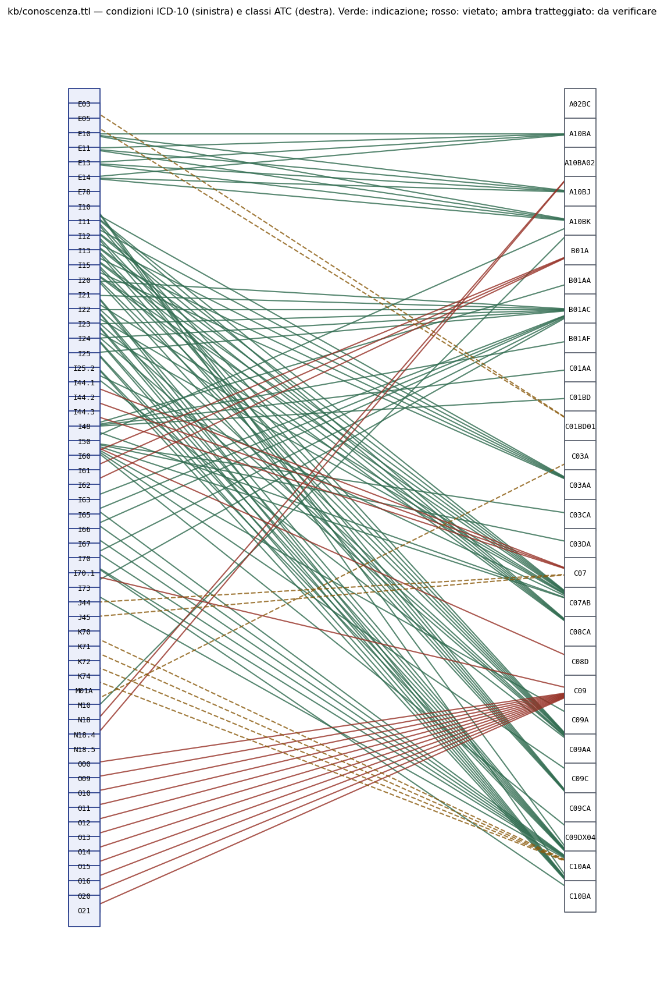

# Step 7 — Il knowledge graph, e la provenienza come struttura

**Stato:** completato.
**Riproducibilità:** `python3 src/kb_build.py --figura` (conoscenza), `python3 src/grafo.py && python3 src/interroga.py` (provenienza)

Lo step 6bis ha misurato per la prima volta il **richiamo** delle tre pipeline, e
il risultato decide la forma di questo step. Sulle condizioni: il gazetteer 19,5%,
il riconoscitore neurale 19,9%, il modello linguistico 70,1%. **Nessuna delle tre
descrive da sola il paziente.**

Un grafo non è quindi una scelta di eleganza architetturale: è l'unica struttura
in cui tre descrizioni parziali e in parte contraddittorie possono convivere senza
che qualcuno debba scegliere fra loro **prima** di sapere quale sia giusta. La
scelta resta possibile, ma diventa una domanda da porre al grafo, non un
irreversibile già consumato in fase di caricamento.

---

## 0. Due grafi, non uno: la conoscenza e la provenienza

Il brief §3.3 chiede un grafo di **conoscenza clinica** — `Drug`, `Condition`,
`Guideline`, `hasIndication`, `hasContraindication`, `recommendedBy` — in un
Turtle versionato in `kb/`, scritto da uno script di import rieseguibile. È
[`kb/conoscenza.ttl`](../kb/conoscenza.ttl), 805 triple, prodotto da
[`src/kb_build.py`](../src/kb_build.py) e letto da
[`src/conoscenza.py`](../src/conoscenza.py). **Il ranker e il filtro prendono
le regole da lì**: 27 indicazioni e 12 controindicazioni, ciascuna con motivo,
classe di raccomandazione o esito, e un nodo `Guideline` con la citazione. Un
test verifica che il Turtle nel repository sia identico a quello che lo script
rigenererebbe, così il motore non ha una copia privata della conoscenza.

Il resto di questo documento descrive il secondo grafo, quello della
**provenienza** (`data/processed/grafo.ttl`, 1,2 M triple, non versionato):
che cosa ogni pipeline ha letto in ogni referto. I due condividono i nodi
`icd:` e `atc:` — stesso spazio di nomi — e la traccia dello step 9ter li
percorre insieme: dalla regola in `kb/conoscenza.ttl` al codice ICD, dal codice
alle menzioni nel referto.

```
kb/conoscenza.ttl                           data/processed/grafo.ttl
kb:indicazione/C03DA-I50                    ric:10086915
  ct:farmaco     atc:C03DA                    ct:haAsserzione  ass:…
  ct:condizione  icd:I50  ◄──── stesso nodo ────  ct:concetto  icd:I50
  ct:classeRaccomandazione "I"                    prov:wasDerivedFrom men:… (pipe:A, 21–39)
  ct:recommendedBy kb:linea_guida/ESC-2021-…
```



**Perché la curatela è manuale, misurato.** Il brief chiede di popolare il
grafo «primariamente da fonti esterne» e di valutarne la copertura. La sonda
`kb_build.py --sonda-wikidata` (17 settembre 2026, numeri nel manifest): dei
439 principi attivi risolti ad ATC, **372** hanno una voce Wikidata con quel
codice (P267); **273** hanno almeno una «condizione trattata» (P2175, 1 820
coppie); **158** almeno un'interazione (P769, 4 372 coppie). La copertura c'è,
ma manca ciò che rende una regola usabile qui: la classe di raccomandazione, il
documento citabile, e un codice ICD-10 per la condizione — lo step 1 aveva già
misurato che solo 343 malattie su 1 177 con etichetta italiana ne hanno uno.
Le 39 regole restano quindi una **mappatura manuale dichiarata** con fonte
puntuale, come il brief prevede per il layer delle linee guida; le
**interazioni farmaco-farmaco non ci sono**, e l'assenza è dichiarata: con 4 372
coppie Wikidata a livello di sostanza sarebbe la prima estensione, con lo stesso
script di import.

---

## 1. La decisione di modellazione che conta

La modellazione ovvia collega il ricovero alla condizione:

```
Ricovero 10086915  ──haCondizione──▶  ICD I48 (fibrillazione atriale)
```

È inutilizzabile. Perde **chi lo dice**, e con esso ogni possibilità di
distinguere una condizione vista da tutte e tre le pipeline da una vista dal solo
gazetteer — cioè esattamente la distinzione che lo step 6 ha mostrato essere la
più pericolosa del progetto.

Qui la **menzione è un nodo**, e il fatto clinico è derivato dalle menzioni che lo
sostengono:

```
Ricovero 10086915
    │ ct:haAsserzione
    ▼
AsserzioneClinica ──ct:concetto──▶ icd:I48 ──skos:broader──▶ icd:I48…
    │  ct:numeroPipeline 3
    │  prov:wasDerivedFrom
    ├──▶ Menzione (pipe:A, Anamnesi, 142-160, irrisolta? no)
    ├──▶ Menzione (pipe:B, Anamnesi, 138-165, stato affermato)
    └──▶ Menzione (pipe:C, Anamnesi, 142-172, soggetto paziente)
```

### Da dove nasce l'asserzione

Le menzioni che si **sovrappongono** nello stesso campo dello stesso referto
diventano **una sola asserzione**, indipendentemente da quale pipeline le abbia
prodotte. È la stessa logica di componenti connesse che lo step 6 usa per
allineare le pipeline (`confronto.raggruppa`), riusata invece che riscritta: se il
grafo allineasse in modo diverso dal confronto, le due misure del progetto
parlerebbero di oggetti diversi chiamandoli con lo stesso nome.

Ne segue la proprietà che rende il grafo utile: `ct:numeroPipeline` **esiste**, ed
è interrogabile. Il filtro dello step 8 può pretendere il consenso di due
pipeline con tre righe di SPARQL, invece di ricalcolare l'allineamento.

### Il gruppo ambiguo resta marcato, non risolto

Quando una pipeline porta **più di una** menzione allo stesso punto — tipicamente
una citazione lunga del modello linguistico che ne abbraccia due corte del
gazetteer — l'asserzione riceve `ct:allineamentoAmbiguo`. Il gruppo dice ancora
*chi* ha visto il punto, ma non permette di appaiare stato e codice: non si
saprebbe quale menzione con quale. Marcare è l'unica alternativa onesta a
scegliere a caso.

---

## 2. Vocabolari: standard dove esistono

Il vincolo di provenienza del progetto — ogni mappatura da una fonte citabile —
vale anche per l'ontologia. Dove esiste una raccomandazione W3C non se ne inventa
una.

| Cosa | Vocabolario | Stato |
|---|---|---|
| Provenienza | **PROV-O**, `prov:Entity` / `Activity` / `Agent`, `prov:wasDerivedFrom`, `prov:wasAttributedTo` | W3C Recommendation, 30 aprile 2013, <https://www.w3.org/TR/prov-o/> |
| Terminologie | **SKOS**, `skos:Concept`, `skos:ConceptScheme`, `skos:broader`, `skos:notation` | W3C Recommendation, 18 agosto 2009 |
| Citazione delle fonti | **DCMI Metadata Terms**, `dcterms:source`, `dcterms:description` | DCMI, standard ISO 15836 |

Nello spazio di nomi locale `ct:` resta **solo** ciò che è specifico di questo
dominio e non ha un equivalente standard: `ct:Ricovero`, `ct:Menzione`,
`ct:AsserzioneClinica`, `ct:stato`, `ct:soggetto`, `ct:numeroPipeline`,
`ct:campoSorgente`, `ct:livelloATC`.

Quello spazio usa `example.org`, riservato dall'**RFC 2606** proprio a questo
scopo: un URI che identifica senza pretendere di risolversi. Dichiararlo è più
onesto che coniare un dominio che non esiste e lasciar credere che si possa
dereferenziare.

### Ogni concetto cita la sua fonte, dentro il grafo

Ogni `skos:Concept` porta un `dcterms:source`. Non è decorazione: è il vincolo del
progetto reso verificabile con un'interrogazione, e c'è un test che fallisce se un
solo concetto ne è privo.

* i 7 211 codici ATC → *AIFA, registro ATC (`atc.csv`), CC-BY 4.0*;
* le 10 803 voci ICD-10 → *ICD-10 2019 in italiano, Volume 1, Centro
  Collaboratore Italiano dell'OMS*.

### Le gerarchie si ricavano dai codici, non si inventano

`skos:broader` in ATC segue il prefisso del codice: `B01AC06` → `B01AC` → `B01A` →
`B01` → `B`. Non è una convenzione di questo progetto, è la **definizione** della
classificazione dell'OMS, dove il livello si legge dalla lunghezza del codice
(1, 3, 4, 5, 7 caratteri per i cinque livelli). Lo stesso in ICD-10, dove `I48.0`
sta sotto `I48`.

Serve la gerarchia **intera**, non solo i codici che compaiono nei referti: la
metrica dello step 11 misura *quanto* due codici siano vicini, e senza i livelli
superiori non ci sarebbe nulla rispetto a cui essere vicini.

---

## 3. Il testo clinico non entra nel grafo

Il grafo è un artefatto serializzato in un file che può circolare. Le menzioni
portano **gli offset, non il testo**: chi ha i dati grezzi ritrova la citazione
dagli offset, chi non li ha non ricostruisce nulla. C'è un test che fallisce se una
stringa clinica compare nel Turtle serializzato.

È la stessa regola già applicata a documenti e test, ma qui va detta due volte,
perché un grafo di provenienza invita naturalmente a portarsi dietro il testo
citato «per poterlo ispezionare». Il file `data/processed/grafo.ttl` resta fra i
percorsi che `.gitignore` esclude.

---

## 4. Cosa c'è dentro

Costruito sui 1 000 ricoveri che tutte e tre le pipeline hanno elaborato — e solo
su quelli: un ricovero visto da due pipeline su tre falserebbe ogni conteggio di
consenso, e la differenza non sarebbe visibile nel grafo.

```
terminologie    ATC      7 211 concetti      ICD-10   10 803 voci
ricoveri            1 000
menzioni           69 533
asserzioni         32 716
  sostenute da 1 agente     24 966   (76,3%)
  sostenute da 2 agenti      2 907   ( 8,9%)
  sostenute da 3 agenti      4 843   (14,8%)
triple          1 210 305
```

### Perché «agente» e non «pipeline», e perché la differenza è enorme

Una versione precedente di questo documento riportava **41,2% / 12,1% / 46,6%**,
e quel 46,6% di «consenso a tre» era **falso**.

I farmaci dei due campi di terapia — circa dodicimila menzioni, più di un terzo
del grafo — comparivano nell'uscita di tutte e tre le pipeline, e il grafo li
attribuiva ad A, B e C come se tre metodi indipendenti fossero giunti alla stessa
conclusione. Ma le tre pipeline leggono quei campi con lo **stesso** parser
deterministico: era **una sola lettura contata tre volte**.

Il filtro dello step 8 l'avrebbe scambiata per una conferma indipendente, cioè si
sarebbe fidato di più proprio dove non aveva imparato nulla di nuovo.

Ora esiste un agente `campo_strutturato`, e `ct:numeroPipeline` conta gli
**agenti distinti**: tre letture dello stesso parser valgono 1, tre
riconoscimenti indipendenti nella prosa valgono 3.

Il quadro che ne esce è meno rassicurante e più vero:

| | prima (sbagliato) | dopo |
|---|---|---|
| un solo agente | 41,2% | **76,3%** |
| due agenti | 12,1% | 8,9% |
| tre agenti | 46,6% | **14,8%** |

**Tre quarti delle asserzioni poggiano su una sola fonte**, e la ridondanza vera
è il 14,8%, non il 46,6%. Una soglia di consenso a due pipeline non scarterebbe
il 41% delle asserzioni ma il **76%**.

**Questo è il compromesso centrale dello step 8**, e il grafo esiste per renderlo
misurabile invece che opinabile. Che il numero sia diventato molto peggiore
dopo una correzione è il motivo per cui la correzione andava fatta: è il genere
di errore che la provenienza serve a prevenire, e ci ero caduto io stesso
costruendo il grafo.

---

## 5. Le interrogazioni

`src/interroga.py` contiene le domande per cui il grafo è stato costruito in
questa forma. Sono in SPARQL e non in Python di proposito: se la risposta si
ottiene interrogando, la struttura è quella giusta; se servisse ricalcolarla in
Python, vorrebbe dire che il grafo non la contiene.

> **Ricostruire costa meno che rileggere.** Il parser Turtle di rdflib è puro
> Python e su 1,2 milioni di triple impiega diversi minuti; costruire il grafo
> dalle uscite delle pipeline ne impiega **dieci secondi**. Il comportamento
> predefinito è quindi ricostruire, e `--grafo` serve solo quando si vuole
> interrogare esattamente il file serializzato — per esempio per verificare che
> la serializzazione non abbia perso nulla.

### Le asserzioni codificate dal solo gazetteer

```sparql
SELECT (COUNT(DISTINCT ?a) AS ?quante) WHERE {
  ?a a ct:AsserzioneClinica ; ct:concetto ?c ; ct:codiceDa pipe:A .
  FILTER NOT EXISTS { ?a ct:codiceDa ?altra . FILTER(?altra != pipe:A) }
}
```

È la domanda più importante del documento. Lo step 6 ha misurato che **tutti e
nove** gli errori esclusivi della pipeline A arrivano già con un codice ICD
assegnato con sicurezza, contro uno solo fra quelli di B e nessuno fra quelli di
C. Il gazetteer riconosce e codifica in un solo passo, quindi un riscontro
sbagliato è già codificato; le altre due riconoscono prima e collegano dopo, e un
riconoscimento sbagliato resta visibile come irrisolto.

Sono quindi gli errori più pericolosi del progetto: **un codice sbagliato che
sembra certo.** Questa interrogazione li isola, e lo step 8 potrà trattarli come
una categoria a sé.

Sul corpus intero sono **129**. Poche in assoluto — lo 0,5% delle asserzioni —
ma sono precisamente la categoria che lo step 6 ha identificato come la più
insidiosa, e ora hanno un nome e un'interrogazione che le elenca.

### Il contributo esclusivo di ciascuna pipeline

```sparql
SELECT ?pipeline (COUNT(DISTINCT ?a) AS ?solo_sua) WHERE {
  ?a a ct:AsserzioneClinica ; ct:numeroPipeline 1 ; prov:wasDerivedFrom ?m .
  ?m prov:wasAttributedTo ?pipeline .
} GROUP BY ?pipeline ORDER BY DESC(?solo_sua)
```

| agente | asserzioni che esistono solo grazie a lui |
|---|---|
| **B** (modello linguistico) | **12 819** |
| `campo_strutturato` (il parser) | 11 833 |
| C (riconoscitore neurale) | 192 |
| A (gazetteer) | 122 |

I quattro numeri sommano esattamente a 24 966, cioè alle asserzioni con
`numeroPipeline = 1`. Il `DISTINCT` non è cosmetico: senza, un'asserzione
sostenuta da tre menzioni dello stesso agente veniva contata tre volte, e il
parser risultava a 35 675 — più del totale delle asserzioni che stava contando.
Un numero più grande del suo insieme è il modo in cui un errore di conteggio si
denuncia da solo.

**È lo step 6bis confermato sul corpus intero, con un metodo diverso.** Il
riferimento annotato misurava su 25 referti che B ha un richiamo del 69% sulle
condizioni contro il 20% delle altre due; qui, su 1 000 referti e senza alcuna
annotazione manuale, si vede la stessa cosa da un altro lato: **fra le pipeline
che riconoscono, B porta da sola sessanta volte più materiale esclusivo di A e C
messe insieme.**

Le 11 833 del parser sono un'altra cosa e vanno lette diversamente: non sono
riconoscimento ma lettura di un campo con delimitatori. Compaiono come «un solo
agente» perché **c'è un solo agente**, non perché due metodi abbiano
dissentito — e il filtro dello step 8 dovrà trattarle come il dato più
affidabile del grafo, non come il meno confermato.

Il che rende quantitativo l'avvertimento del § 4: una soglia di consenso a due
pipeline non scarterebbe «le asserzioni dubbie». Scarterebbe **il contributo
esclusivo della sola pipeline con un richiamo alto, e per di più l'intera terapia
dei pazienti**, che è il dato di cui il sistema ha più bisogno e quello su cui
sbaglia di meno.

### Negazione e familiarità sono sopravvissute

```
affermato   paziente     23 574
negato      paziente      1 433
affermato   familiare     1 138
incerto     paziente        489
negato      familiare       190
incerto     familiare        16
ignoto      paziente          1
```

**Il 12,2% delle menzioni di condizione** non è una condizione attuale del
paziente. Un sistema che appiattisse il grafo su «quali malattie ha questo
paziente» sbaglierebbe una volta su otto, e nei 1 344 casi familiari sbaglierebbe
*persona*.

Che i due assi siano indipendenti si legge nelle 190 menzioni `negato` +
`familiare`: «familiarità negativa per cardiopatia ischemica» è insieme familiare
e negata, e comprimerle in un solo campo `stato` perderebbe l'una o l'altra.

### La gerarchia ATC percorsa davvero

Risalendo `skos:broader+` dal principio attivo al livello terapeutico, i dieci
gruppi più presenti nel corpus:

| codice | gruppo | asserzioni |
|---|---|---|
| B01 | antitrombotici | 2 187 |
| C07 | betabloccanti | 1 338 |
| C03 | diuretici | 1 261 |
| C10 | sostanze ipolipemizzanti | 1 123 |
| C09 | sostanze ad azione sul sistema renina-angiotensina | 1 005 |
| A02 | antiacidi, antimeteorici e antiulcera peptica | 954 |
| A10 | farmaci usati nel diabete | 885 |
| C01 | terapia cardiaca | 715 |
| C08 | calcioantagonisti | 344 |
| G04 | urologici | 341 |

**È un controllo di sanità dell'intera catena, non solo del grafo.** Sette dei
dieci gruppi sono cardiovascolari, nell'ordine esatto in cui un reparto di
cardiologia li prescrive: antiaggreganti e anticoagulanti, betabloccanti,
diuretici, statine, ACE-inibitori e sartani. Se la risoluzione ATC fosse
sistematicamente sbagliata, o la gerarchia collegata male, questa classifica non
avrebbe questa forma. Le tre voci non cardiologiche — gastroprotettori,
antidiabetici, urologici — sono le comorbidità e le coprescrizioni che ci si
aspetta in una popolazione anziana.

> La sottointerrogazione che aggrega per concetto *prima* di percorrere
> `skos:broader+` non è un dettaglio: senza, il cammino viene ripetuto per
> ciascuna delle 32 907 asserzioni invece che per i codici distinti, e rdflib
> impiega minuti dove basta un secondo.

### Quanto resta senza codice

| | menzioni | irrisolte | |
|---|---|---|---|
| condizioni | 26 841 | 10 959 | **40,8%** |
| farmaci | 42 692 | 3 750 | **8,8%** |

Il vincolo del progetto è conservare, non cancellare: queste menzioni restano nel
grafo, marcate `ct:irrisolta`, e sono **informazione**. Il 41% di condizioni
irrisolte è la stessa realtà che lo step 6bis ha misurato dall'altro lato: la
prosa cardiologica non è scritta in forma da nomenclatura, e un vocabolario
costruito dai termini ICD-10 non la copre. Una pipeline che scartasse gli
irrisolti restituirebbe un grafo più pulito e avrebbe cancellato la prova del
proprio limite.

Lo scarto fra il 41% delle condizioni e il 7,8% dei farmaci è la stessa asimmetria
già vista: un nome di farmaco è un nome e un dizionario lo trova, una condizione
è una descrizione e un dizionario no.

---

## 6. Cosa il grafo non fa, deliberatamente

**Non decide.** Non fonde le contraddizioni, non scioglie un `affermato` contro un
`negato` quando due pipeline dissentono, non scarta le menzioni irrisolte, non
sceglie un codice quando due pipeline ne propongono due diversi.

È una scelta, non un'omissione. La decisione appartiene allo step 8, che deve
essere **simbolico e ispezionabile** perché è il punto in cui il sistema smette di
descrivere e comincia a raccomandare. Un grafo che decidesse spargerebbe quella
logica in un punto dove nessuno la cerca.

Il grafo conserva tutto e segna chi dice cosa. È l'intero suo compito.

---

## 7. Test

15 test in `tests/test_grafo.py`. Non verificano numeri: verificano le proprietà
strutturali da cui dipenderanno le decisioni dello step 8.

| Proprietà | Perché, se si rompesse, non si noterebbe |
|---|---|
| Menzioni sovrapposte → **una** asserzione | Due pipeline d'accordo sembrerebbero due fatti clinici distinti, e il consenso diventerebbe indistinguibile dalla ripetizione |
| Lo stesso punto in **campi diversi** non si fonde | Gli offset ripartono da zero in ogni campo: una condizione dell'anamnesi si fonderebbe con un farmaco della terapia |
| Ogni menzione è attribuita alla sua pipeline | Nessuna interrogazione sulla provenienza darebbe la risposta giusta, e tutte darebbero *una* risposta |
| Il gruppo ambiguo è marcato | Si confronterebbero stato e codice di menzioni non appaiabili |
| Una menzione irrisolta **resta** | Si perderebbero proprio i casi che il progetto deve esaminare, e il grafo sembrerebbe più completo di quanto sia |
| Stato e soggetto sopravvivono | Una condizione negata, o del padre, diventerebbe una condizione del paziente |
| Il testo clinico **non** entra nel Turtle | Il file circolerebbe con dentro i referti |
| Ogni concetto cita la fonte | Il vincolo di provenienza sarebbe un'affermazione nel documento invece di una proprietà del dato |
| La gerarchia ATC risale al livello anatomico | La metrica dello step 11 misurerebbe distanze su un albero troncato |
